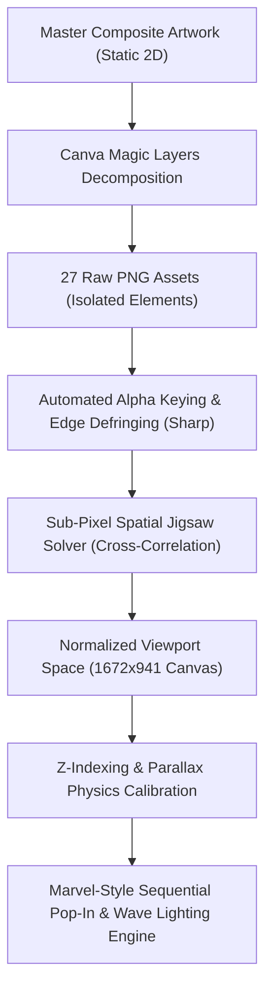

# 2.5D Layered Collage Reconstruction & Interactive Assembly Pipeline

> **Architecture & Engineering Guide**  
> How a single flat 2D editorial composite was decomposed into 27 discrete spatial planes, automatically solved like a jigsaw puzzle, and reassembled into a high-performance, responsive 2.5D parallax canvas with cinematic Marvel-style pop-in and luminous wave lighting.

---

## 1. Pipeline Overview



---

## 2. Step-by-Step Technical Implementation

### Step 1: Layer Decomposition with Canva Magic Layers
From a single high-resolution master artwork (`combined_reference.jpg`), Canva's Magic Layers segmentation engine was used to isolate 27 individual semantic assets:
- **Environment & Spire Layers**: Distant clouds, Howrah Bridge, colonial domes, Kolkata cityscape.
- **Atmospheric Accents**: Flying birds, coconut palms, windmills.
- **Maritime Ground**: Traditional Hooghly wooden dinghies, motorboats, and water plane.
- **Narrative Connecting Fabric**: Magenta gamcha / silk scarves weaving across the canvas.
- **Student Innovator Clusters**:
  - *Left*: Grassroots & clean-tech (microscopes, solar panels, laptops, rural mentorship).
  - *Center*: Venture ideation & smartboard pitching.
  - *Right*: Medical practitioners, drone operators, and scale.

Each asset was named systematically with its approximate depth plane:
`Z02_far_skyline_top.png`, `Z05_Howrah_bridge.png`, `Z09_redcloth_right.png`, `Z13_rockwithpeople_bottom_left.png`, etc.

---

### Step 2: Automated Transparency & Edge Defringing
When elements are extracted from flat art, they often carry solid white or off-white background halos. To achieve true photographic depth, we built an automated Node.js processing script using `sharp`:

- **Threshold Luma-Keying**: Pixels with high luminance ($R, G, B > 248$) are mapped to $\alpha = 0$.
- **Soft Alpha Falloff**: Edge transition band ($235 < \text{luma} \le 248$) is linearly ramped to prevent jagged staircasing.
- **Edge Defringing**: Removing light fringe bleeding onto dark edges by pre-multiplying alpha or feathering masks.
- **Output Directory**: `client/public/assets/kolkata-ui/transparent/`.

---

### Step 3: Spatial Jigsaw Solving via Template Matching
The isolated cutouts came as cropped bounding boxes without explicit screen coordinates. To place them back with sub-pixel precision into the 1672×941 canvas:

1. **Master Reference Alignment**: The original composite (`combined_reference.jpg`) was scaled to canonical canvas dimensions ($1672 \times 941$).
2. **Feature Pixel Sampling**: High-confidence, non-transparent pixels from each cutout were extracted into point clouds.
3. **Cross-Correlation Search**:
   $$\text{Diff}(s_x, s_y) = \sum_{i} \left| R_{\text{ref}}(s_x + x_i, s_y + y_i) - R_{\text{cutout}}(x_i, y_i) \right| + \dots$$
4. **Global Minimum Optimization**: The location with the lowest $L_1$ color distance was chosen as the true $(x, y)$ coordinate.

*Example Correction*:
- `Z04_building_center`: Coarse search had initially placed it at $y = 182$ (in the sky). High-resolution correlation relocated it to its true home at $x = 886, y = 363$ ($38.58\%$ top), right along the riverbank horizon behind the Howrah Bridge.
- `Z06_birds_center`: Relocated from $x = 1168$ to $x = 599, y = 403$ directly soaring over the Howrah Bridge.

---

### Step 4: Full-Bleed Aspect Ratio Preservation
To ensure that all 27 layers never shift, letterbox, or misalign across mobile, ultrawide, or 4K monitors:

```css
/* Full-bleed responsive container */
width: max(100vw, calc(100vh * (1672 / 941)));
height: max(100vh, calc(100vw * (941 / 1672)));
aspect-ratio: 1672 / 941;
```

All layer coordinates are specified as precise percentages:
- `leftPct = (x / 1672) * 100`
- `topPct = (y / 941) * 100`
- `widthPct = (width / 1672) * 100`
- `heightPct = (height / 941) * 100`

---

### Step 5: Depth Planes & Multi-Layer Parallax Physics
Each layer is assigned a physical Z-plane ($Z = 1$ to $Z = 13$) and a calibrated parallax factor:
- **Sky Background ($Z = 1$)**: Parallax `0.06` (nearly stationary, massive scale).
- **Distant Monuments & Bridges ($Z = 2 - 5$)**: Parallax `0.15 - 0.45`.
- **Hooghly River & Boats ($Z = 8$)**: Parallax `0.7 - 0.85`.
- **Student Clusters & Gamcha Ribbons ($Z = 9 - 12$)**: Parallax `1.0 - 1.25`.
- **Extreme Foreground ($Z = 13$)**: Parallax `1.45` (rapid foreground movement).

Scroll displacement formula:
$$\Delta y = \text{scrollY} \times \text{layer.parallax} \times 0.3$$

---

### Step 6: Marvel-Style Sequential Pop-In & Diagonal Wave Lighting

Instead of a generic slow fade-in, the assembly uses an energetic cinematic sequence:

1. **Phase 0 (Empty Canvas)**: The sky base renders silently. All 26 component cutouts are hidden (`scale(0.85)`, `opacity: 0`).
2. **Phase 1 (Staccato Pop-In, 0ms - 1500ms)**:
   - Each component pops into view with a 45ms - 60ms stagger in depth order.
   - Spring curve: `cubic-bezier(0.34, 1.56, 0.64, 1)` creating a tangible comic-book panel punch.
3. **Phase 2 (Diagonal Luminous Contour Wave, 1500ms - 2400ms)**:
   - A brilliant neon-magenta & white edge wave sweeps diagonally from **Top-Right** down to **Bottom-Left**.
   - As the wave passes each element's diagonal index:
     $$\text{diagScore} = (100 - \text{leftPct}) \times 0.5 + \text{topPct} \times 0.5$$
     The element's silhouette contours ignite with an animated `filter: drop-shadow(0 0 16px #f20089) drop-shadow(0 0 4px #ffffff)`.
4. **Phase 3 (Lockup & Idle Atmosphere)**:
   - "HULT PRIZE" typography and navbar lock into position.
   - Micro-atmospheres (boat gentle water bobs, 35mm film grain, 2.5D mouse parallax) remain active.

---

## 3. Potential Future Expansions

1. **Chapter Exploration Hotspots**: Clicking on the 3 student clusters zooms the virtual camera into that cluster with contextual sound design.
2. **Audio-Reactive Wave**: Ambient sound effects (river ripples, ambient university murmur) syncing with scroll depth.
3. **Gyroscope Mobile Parallax**: Using device orientation to let mobile visitors "look around" the Kolkata collage in 3D.
