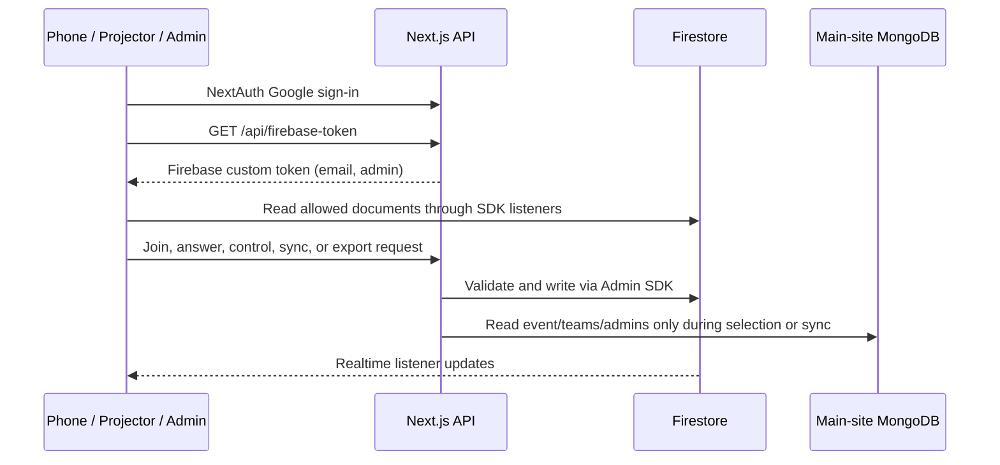

# Hult Prize Quiz — Implementation and Test Report

**Report date:** 2026-09-27

**Scope:** Firebase migration for the standalone `quiz/` app
**Status:** Local implementation, automated tests, production build, and emulator load simulation complete. Real Firebase project setup, browser acceptance, deployment, and venue rehearsal remain open.

## Executive summary

The quiz now uses Firestore as its live database. The Next.js server owns every write, while phones, the projector, the always-on leaderboard, and admin pages receive live updates through Firestore listeners. NextAuth remains the Google login system; an API route exchanges the signed-in identity for a Firebase custom token so Firestore rules can limit what each browser reads. MongoDB is isolated to event, team, and admin-role reads during event selection and roster sync.

The implementation has passed **121 automated tests across 21 test files**, TypeScript checking, ESLint, and a production build. The production-build emulator simulation completed the entire 15-question flow for 47 eligible teams, with correct scores and CSV export, under its audience and usage limits. Its latest run projected **24,241 reads and 2,761 writes**, with **201 ms p95 host-action propagation** and **127 ms p95 answer API latency**.

These results verify the code against the Firebase Emulator Suite. They do not yet verify Google OAuth with the production Firebase project, real Firestore billing/quota, Vercel environment configuration, domain routing, MongoDB connectivity for a live event, or venue Wi-Fi.

## What was built

### Participant experience

- `/` accepts a six-digit quiz session code.
- `/s/<code>` signs a participant in, checks the team in when the lobby is open, and displays team and quiz state.
- A team lead can choose which registered member answers. Teammates see read-only progress.
- The lead-in, question timer, answer lock, reveal, result distribution, leaderboard, and final rank update from Firestore listeners.
- Only the selected taker on the device bound at check-in can submit. The first valid answer is retained; duplicate submissions do not replace it.
- The participant client subscribes to exactly two documents: the public session and that participant's own team document. It does not subscribe to a collection.

### Projector and second screen

- `/present/<code>` displays the QR code, join code, check-in counter, current question/timer, live answered count, reveal distribution, top 10, and final podium.
- `/present/<code>/board` provides an always-on leaderboard for a second display.
- The public projector requires no login. It reads public session state and per-team counter shards; it cannot read rosters, question answer keys, or audit answers.

### Admin experience

- `/admin` creates quiz sessions linked to the selected main-site event.
- `/admin/s/<code>` provides live controls, question editing and CSV import, team/check-in management, taker reassignment, device reset, roster sync, and CSV export.
- Stale host actions are rejected with `stateVersion` checks rather than silently overwriting a newer state.
- Team sync reports new, updated, eligible, removed/ineligible teams and the last sync time. Re-sync updates roster details while preserving check-in and quiz progress. Manually-managed quiz admins are preserved.
- `npm run sync-teams -- <six-digit-session-code>` provides the same sync operation from a terminal.

### Runtime and security

- Firestore stores sessions, full question documents, team snapshots and scores, answer audit documents, admin identities, and live counter shards.
- All browser writes are denied in Firestore rules. Route handlers use the Firebase Admin SDK and perform input, membership, device, eligibility, phase, and admin checks.
- A NextAuth session calls `/api/firebase-token`; the server mints a Firebase custom token with normalized email and admin claims. The browser signs in with that token. Sign-out clears both auth sessions.
- Firestore rules make session and counter data public for the projector; limit question and answer documents to admins; and limit team documents to team members and admins.
- Correct answers and distributions are withheld until reveal. A participant's answer is stored without correctness until server-side grading at reveal.
- A per-team counter document at `quizSessions/{code}/counts/{teamId}` replaces a shared mutable counts document. Each team updates only its own shard; the projector aggregates shard values locally.
- Mongo access is confined to `lib/sync/mongo-read.ts`. It reads event teams and site admin roles. A guard test prevents Mongo write calls and checks that other quiz runtime modules do not import the site Mongo models/connection.
- The quiz is standalone; this change does not move `client-v3/` off MongoDB.

## Quiz lifecycle and data flow

1. An organizer creates a session and selects an event. The event title and ID are copied into the session.
2. Team sync reads that event's registered teams and site admins from MongoDB, snapshots them into Firestore, and initializes one counter shard per team.
3. A team member checks in during the lobby; the first member check-in is idempotent. The lead can select the taker, whose device is then bound.
4. Starting the quiz closes check-in and opens the first question after the three-second lead-in.
5. The selected taker submits one answer from the bound device. The answer is saved with its response time, and the live shard is updated.
6. Reveal grades checked-in teams, applies the unanswered time penalty, updates scores and rankings, then exposes the answer and distribution.
7. The host advances through the questions and ends the session. End grades a current ungraded question, publishes the final standings, and supports CSV export.

### Firestore document map

| Path | Purpose and browser access |
|---|---|
| `quizSessions/{code}` | Public, answer-safe session state and current question; answer key fields only appear after reveal. |
| `quizSessions/{code}/counts/{teamId}` | Public counter shard containing eligibility, check-in, and current-answer count fields. Projector sums these shards. |
| `quizSessions/{code}/questions/{qid}` | Full question including correct index; admin read only. |
| `quizSessions/{code}/teams/{teamId}` | Roster and team state/scores; readable to team members and admins. |
| `quizSessions/{code}/answers/{teamId}_{qid}` | Per-team/per-question answer audit trail; admin read only. |
| `quizAdmins/{email}` | Admin list synchronized from site roles plus separately managed quiz admins. |

## Architecture and scaling choices

### Live updates and listeners

- Phones listen to the public session plus their team document. The two-document listener contract has a dedicated test.
- Projector and board subscribe to the public session; the projector additionally listens to counter shards.
- Admin tabs listen to the session, teams, and questions only where needed. The test simulator accounts for two admin team listeners.
- Timers tick in the browser; `/api/time` estimates server time without a Firestore read.
- Firestore local persistent cache is enabled so reloads and brief disconnects can recover state from the SDK.

### Transaction contention fixed during verification

The first production-load run exposed two issues that ordinary unit coverage had not surfaced. A single shared counts document caused concurrent check-ins to time out. After replacing it with per-team shards, the emulator still timed out when the email-to-team array query ran inside each concurrent transaction. The join and answer paths now resolve the team with a query before opening the small transaction, then transactionally re-read the session and the specific team document before writing. With those changes, the 47-team burst and full answer flow passed without server errors. This design keeps each team's writes on distinct team and shard documents while preserving checks against fresh team/session state.

### Quota and scale interpretation

The simulator models 200 phones, a projector, a board, and two admin consoles. It counts listener document events directly in the emulator and estimates API/server reads and writes. Its latest measured figures were:

| Metric | Latest run | PRD threshold | Result |
|---|---:|---:|---|
| Simulated audience | 200 phones + projector + board + 2 admin consoles | 200-device audience | Passed |
| Host-action propagation p50 / p95 | 94 / 201 ms | p95 < 1,000 ms | Passed |
| Answer API latency p50 / p95 | 73 / 127 ms | p95 < 1,000 ms | Passed |
| Listener document events (read proxy) | 21,328 | — | Measured in emulator |
| Estimated server reads | 2,913 | — | Estimated |
| Projected total reads | 24,241 | <= 35,000 | Passed |
| Estimated writes | 2,761 | <= 10,000 | Passed |
| Server/network errors | 0 | 0 | Passed |
| Score mismatches across 47 eligible teams | 0 | 0 | Passed |

The standard Firestore free quota currently lists 50,000 document reads and 20,000 document writes per day; quota is shared by activity in the project and resets daily. One projected worst-case quiz is about 49% of the daily read allowance. A rehearsal and event on the same quota day would use about 48.5k modeled reads, leaving little margin for other project activity. Confirm actual usage in the Firebase console before an event; emulator counts are a model, not a billable production measurement. See [Firebase's Firestore pricing documentation](https://firebase.google.com/docs/firestore/pricing).

The per-team counter shards avoid the shared-write hotspot and keep phone listeners bounded. The measured figures support a 50-team event under the modeled conditions. They do not establish production quota use or guarantee the venue's internet, mobile-device behavior, or Vercel runtime performance.

## Verification record

All local checks below were run from `quiz/` on 2026-09-27.

| Check | Result |
|---|---|
| `npm test` | **Passed:** 21 files, 121 tests, using Firestore/Auth emulators. Includes security rules, sessions/questions, joins, takers, answers, grading, team sync, auth bridge, and pure logic. |
| `npx tsc --noEmit` | **Passed:** no TypeScript errors. |
| `npm run lint` | **Passed with one pre-existing warning:** unused `_` in `components/motion-primitives/text-effect.tsx:183`; no lint errors. |
| `npm run build` | **Passed:** optimized Next.js webpack production build and route compilation. |
| `npm run seed` | **Passed:** guarded demo session `424242`, 50 teams (47 eligible), 15 questions. |
| `npm run simulate` against production build + emulators | **Passed:** complete lifecycle and load thresholds in the table above. |

The automated suite also verifies that anonymous users can read only public session/counter data, members can read only their own team, answer/question data is protected, browser writes fail, signed-out token requests return 401, custom-token claims are set, and sync preserves quiz state while using only Mongo read calls.

## Changed project docs and useful entry points

- [Firebase PRD](superpowers/specs/2026-09-26-quiz-firebase-prd.md) — source requirements and checked implementation/test status.
- [Quiz system guide](quiz-system.md) — screens, runtime components, data access and lifecycle.
- [Quiz runbook](quiz-runbook.md) — emulator setup, production-build load test, event-day operations and recovery.
- [Quiz README](../quiz/README.md) — commands and app entry points.
- [Project orientation](../aheen.md) — app map and owner setup that remains open.

Primary implementation areas are `quiz/lib/quiz/` (business logic and Firestore services), `quiz/lib/firebase/` (Admin/client config and token bridge), `quiz/lib/sync/` (Mongo read + Firestore sync), `quiz/app/api/` (server routes), `quiz/components/` and `quiz/hooks/` (screens and listeners), `quiz/firestore.rules`, `quiz/tests/`, and `quiz/scripts/`.

## What is still needed to finish live acceptance

The Firebase project is **not required** for the local implementation or emulator tests. It is required for the following production checks and release work:

1. Create the Firebase project on the intended owner account and create its first Firestore database in **`asia-south1` (Mumbai)**. The region is fixed after creation. Confirm the project ID.
2. Register a Firebase Web app and configure its public web values: `NEXT_PUBLIC_FIREBASE_API_KEY`, `NEXT_PUBLIC_FIREBASE_AUTH_DOMAIN`, `NEXT_PUBLIC_FIREBASE_PROJECT_ID`, and `NEXT_PUBLIC_FIREBASE_APP_ID`.
3. Create a server service account and configure `FIREBASE_SERVICE_ACCOUNT` in the local production environment and Vercel. Keep the private key in the secret store; it is not needed in chat.
4. Provide authorized access to the Vercel project/environment and confirm the deployment target, quiz hostname, and DNS owner. Configure `AUTH_SECRET`, `AUTH_URL`, `AUTH_TRUST_HOST`, Google client ID/secret, and `ADMIN_EMAILS` there.
5. Add the deployed quiz's NextAuth Google callback URL to the existing OAuth client. Confirm the production login account domain and admin email list.
6. Supply the main-site MongoDB read connection and the event that will host the quiz. The sync script is `npm run sync-teams -- <session-code>`; it copies the selected event's teams and site admin emails to Firestore.
7. Deploy, then run the manual browser checklist using real admin, projector, taker, and teammate sessions. Confirm Google sign-in, sync counts, reconnect behavior, and live quiz flow.
8. Record real-project Firestore usage after a rehearsal, and complete a venue Wi-Fi rehearsal with at least three real phones.

Do not configure emulator-only switches or development login overrides in Vercel. The live project has not been created or deployed as part of this implementation, so the final two acceptance steps remain unverified.
